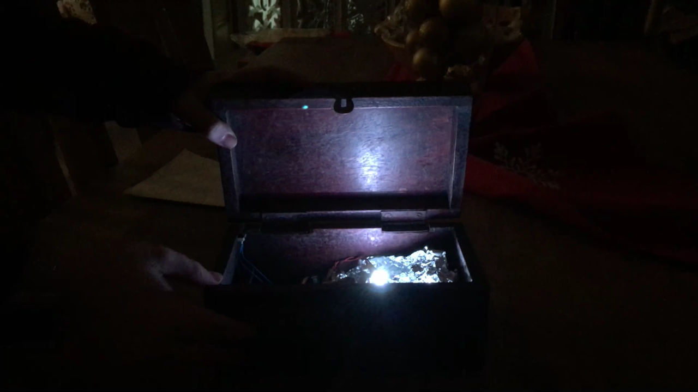
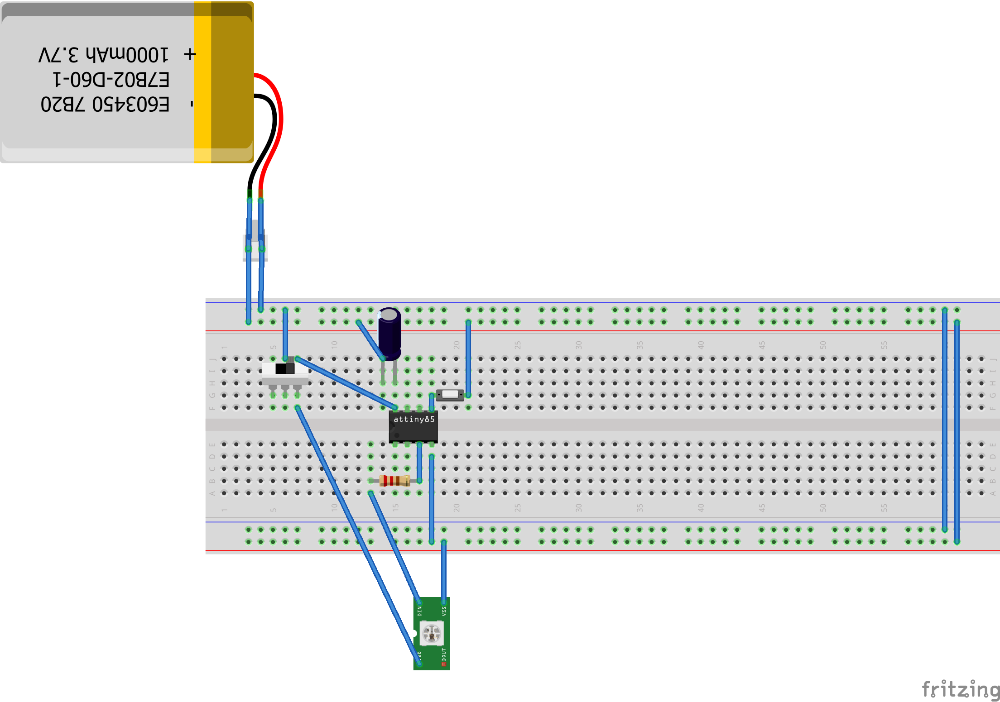

Pandora box LED prop
====================

Basic design to light-up a box from the inside when it is open - used as a "Pandora box" prop for a drama class play.

See it in action [here](https://youtu.be/LbA9x33jiaw)

Building it
----------

The design is quite simple: when the momentary switch is opened one of the inputs in the micro-controller detects it and triggers the fade-in sequence for the LEDs. When the switch is closed, the LEDs are switched off.

You will need the following components:

* **ATtiny85 microcontroller** or you can use any arduino-compatible MCU, we just chose the ATtiny because of its size
* **Momentary switch** to detect when the box is opened)
* **Sliding switch** to save on battery when not in use)
* **Strip of 3 x WS8212 RGB LEDs** - you can use more but take into account the additional current when sizing the battery
* **3.7v 600mAh LiPo battery**
* **a low value resistor, e.g. 220-470 ohm** to protect the LED data channel from voltage spikes
* **a large 1000 uF 10V capacitor** to protect the LEDs from voltage spikes

The assembly is quite simple, just follow the breadboard design:

The only complicated part is on the connectivity to the ATtiny85: the LED strip "data in" (DI) pin must be connected to pin PB4 on the microcontroller, while the momentary switch should be tied to pin PB0.

If you want to move beyond the breadboard (we used a protoboard for the permanent prop) you can find a [fritzing project](https://github.com/llmora/electronics/raw/master/pandora_box_led/pandora_box_led.fzz.fzz) in the repository to help you design your PCB.

Uploading the code
------------------
The code that runs on the micro-controller can be found in the [pandora_box_led.ino](pandora_box_led.ino) file on this repository. The code runs both on the ATtiny85 and an Arduino compatible board (which makes testing easier). Because the ATtiny85 does not have an USB interface you will need an AVR programmer to upload the code, [you can use an Arduino to build an affordable one](https://create.arduino.cc/projecthub/arjun/programming-attiny85-with-arduino-uno-afb829).

The code is quite simple, remember to update the NUM_LEDS reference if you use a strip with a different amount of LEDs.

Credits
-------
The code is based on attiny_pixel_touch by Dana Sniezko (https://github.com/danasf/attiny_pixel_switch/blob/master/attiny_pixel_touch.ino), released under GPLv3
